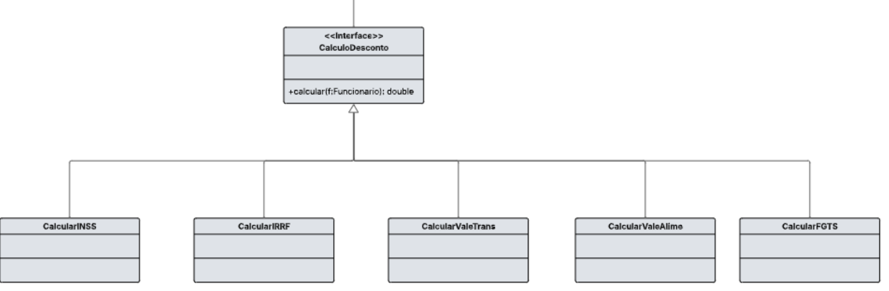

# Padrão de Projeto Utilizado
**Strategy (Padrão Comportamental)**

---

## 📘 Justificativa da Escolha
O padrão **Strategy** foi escolhido porque o sistema de folha de pagamento exige diferentes regras de cálculo de descontos, como **INSS**, **IRRF**, **FGTS** e outros.

Cada desconto possui regras e fórmulas próprias. Sem o Strategy, essas regras ficariam misturadas em uma única classe, gerando:

- Código difícil de manter  
- Muitos condicionais (`if`/`else`)  
- Baixa flexibilidade  
- Risco de quebrar outros cálculos ao alterar algum

Com o Strategy:

- Cada cálculo vira uma estratégia independente  
- Todas as estratégias implementam a interface `ICalculoDescontos`  
- É possível adicionar novos cálculos sem alterar código existente  
- O sistema consegue trocar a regra de cálculo conforme necessário

Isso aumenta a clareza, manutenção e extensibilidade da aplicação.

---

## 🧩 Classes Criadas e Modificadas

### **Interface (Strategy)**
- `ICalculoDescontos.java`

### **Estratégias Concretas**
- `CalcularINSS.java`
- `CalcularIRRF.java`
- `CalcularFGTS.java`
- (e outros cálculos do sistema)

---


---

## 💻 Exemplo de Código (Estratégia Concreta – INSS)

```java
@Service
public class CalcularINSS implements ICalculoDescontos {

    private final TotalSalarioBruto SalarioBruto;

    public CalcularINSS(TotalSalarioBruto SalarioBruto) {
        this.SalarioBruto = SalarioBruto;
    }

    @Override
    public double calcularDesconto(Funcionario f) {
        double salarioInicial = SalarioBruto.calcularSalarioTotalBruto(f);

        double tetoINSS = 7507.49;
        if (salarioInicial > tetoINSS) {
            salarioInicial = tetoINSS;
        }

        double limiteFaixa1 = 1302.00;
        double limiteFaixa2 = 2571.29;
        double limiteFaixa3 = 3856.94;

        double descontoTotal = 0.0;

        if (salarioInicial > 0) {
            double valorNestaFaixa = Math.min(salarioInicial, limiteFaixa1);
            descontoTotal += valorNestaFaixa * 0.075;
        }
        if (salarioInicial > limiteFaixa1) {
            double valorNestaFaixa = Math.min(salarioInicial - limiteFaixa1, limiteFaixa2 - limiteFaixa1);
            descontoTotal += valorNestaFaixa * 0.09;
        }
        if (salarioInicial > limiteFaixa2) {
            double valorNestaFaixa = Math.min(salarioInicial - limiteFaixa2, limiteFaixa3 - limiteFaixa2);
            descontoTotal += valorNestaFaixa * 0.12;
        }
        if (salarioInicial > limiteFaixa3) {
            double valorNestaFaixa = salarioInicial - limiteFaixa3;
            descontoTotal += valorNestaFaixa * 0.14;
        }

        return Math.round(descontoTotal * 100.0) / 100.0;
    }
}

```

## 🧱 Diagrama UML (Padrão Strategy)




